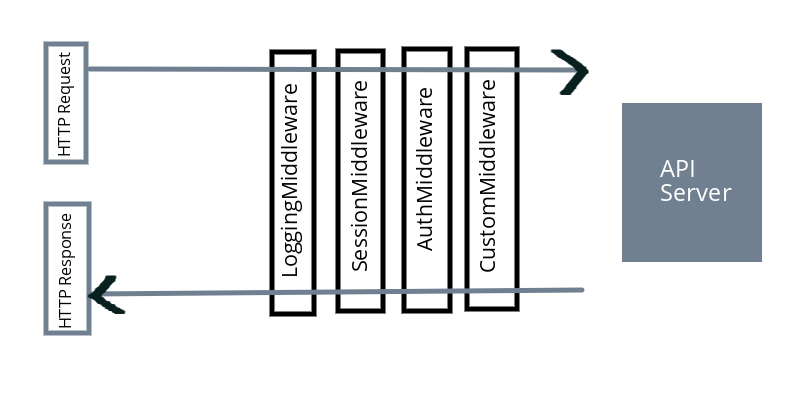

# Building RESTful Web services with Go

Outline:
- [Resource](#resource)
- [Types of status codes](#types-of-status-codes)
- [What is middleware?](#what-is-middleware)
- [What is RPC?](#what-is-rpc)
- [What is a proxy server?](#what-is-a-proxy-server)
- [JSON Web Tokens](#json-web-tokens)
- [Tips](#tips)

## Resource
- [Book](https://www.packtpub.com/application-development/building-restful-web-services-go?utm_source=github&utm_medium=repository&utm_campaign=9781788294287)
- [Codes](https://github.com/PacktPublishing/Building-RESTful-Web-Services-with-Go)

## Types of status codes

### 2xx family (successful)
200 and 201 fall under the success family. They indicate that an operation was successful. Plain 200 (Operation Successful) is a successful CRUD Operation:

- **200** (Successful Operation) is the most common type of response status code in REST
- **201** (Successfully Created) is returned when a POST operation successfully creates a resource on the server
- **204** (No content) is issued when a client needs a status but not any data back

### 3xx family (redirection)
These status codes are used to convey redirection messages. The most important ones are 301 and 304:  

- **301** is issued when a resource is moved permanently to a new URL endpoint. It is essential when an old API is deprecated. It returns the new endpoint in the response with the 301 status. By seeing that, the client should use the new URL in response to achieving its target.
- The **304** status code indicates that content is cached and no modification happened for the resource on the server. This helps in caching content at the client and only requests data when the cache is modified.

### 4xx family (client error)
These are the standard error status codes which the client needs to interpret and handle further actions. These have nothing to do with the server. A wrong request format or ill-formed REST method can cause these errors. Of these, the most frequent status codes API developers use are 400, 401, 403, 404, and 405:

- **400** (Bad Request) is returned when the server cannot understand the client request.
- **401** (Unauthorized) is returned when the client is not sending the authorization information in the header.
- **403** (Forbidden) is returned when the client has no access to a certain type of resources.
- **404** (Not Found) is returned when the client request is on a resource that is nonexisting.
- **405** (Method Not Allowed) is returned if the server bans a few methods on resources. GET and HEAD are exceptions.

### 5xx family (server error)
These are the errors from the server. The client request may be perfect, but due to a bug in the server code, these errors can arise. The commonly used status codes are 500, 501, 502, 503,  and 504:

- **500** (Internal Server Error) status code gives the development error which is caused by some buggy code or some unexpected condition
- **501** (Not Implemented) is returned when the server is no longer supporting the method on a resource
- **502** (Bad Gateway) is returned when the server itself got an error response from another service vendor
- **503** (Service Unavailable) is returned when the server is down due to multiple reasons, like a heavy load or for maintenance
- **504** (Gateway Timeout) is returned when the server is waiting a long time for a response from another vendor and is taking too much time to serve the client

For more details on status codes, visit this link: https://developer.mozilla.org/en-US/docs/Web/HTTP/Status

## What is middleware?

Middleware is an entity that hooks into a server's request/response processing.
So virtually all middleware should perform these functions in order:

1.Process the request before hitting the handler (function)
2.Process the handler function
3.Process the response before giving it to the client

[Examples](3-1-middleware)

The most common use cases are:

- Use a logger to log each and every request hitting the REST API
- Validate the session of the user and keep the communication alive
- Authenticate the user, if not identified
- Write custom logic to scrap the request data
- Attach properties to responses while serving the client

## What is RPC?
Remote Procedure Call (RPC) is an interprocess communication that exchanges information between various distributed systems. 
A computer called Alice can call functions (procedures) in another computer called Bob in protocol format and can get the computed result back. 
Without implementing the functionality locally, we can request things from a network that lies in another place or geographical region.

The entire process can be broken down into the following steps:

- Clients prepare function name and arguments to send
- Clients send them to an RPC server by dialing the connection
- The server receives the function name and arguments
- The server executes the remote process
- The message will be sent back to the client
- The client collects the data from the request and uses it appropriately

[Examples](3-2-rpc)

## What is a proxy server?
- A proxy server is a server that holds the information of original servers in it. 
- It acts as the front block for the client request. 
- Whenever a client makes an HTTP request, it can directly go the application server.
- But, if the application server is written in a programming language, you need a translator that can turn the application response into a client-understandable response. 
- Common Gateway Interface (CGI) does the same thing.
-  For Go, we can run a simple HTTP server and it can work as a normal server (no translation required).

## Why is an API gateway required?
An API gateway is a broker that sits in between the client and the server and forwards the request to the server on passing specific conditions.

Basically, an API getaway does these things:

- Logging
- Security
- Traffic control
- Transformations

[Examples](11-api-gateway-kong)

## JSON Web Tokens

- The modern REST API implements token-based authentication. 
- Here, tokens can be any strings generated by the server, which allows the client to access resources by showing the token. 
- Here, the token is computed in such a way that the client and the server only know how to encode/decode the token. 
- JWT tries to solve this problem by enabling us to create tokens that we can pass around.

The steps can be summarized more briefly as follows:

1. The client passes the username/password in a POST request to the login API.
2. The server authenticates the details and if successful, it generates a JWT and returns it back instead of creating a cookie. It is the client's responsibility to store this token.
3. Now, the client has the JWT. It needs to add this in subsequent REST API calls such as GET, POST, PUT, and DELETE in the request headers.
4. Once again, the server checks the JWT and if it is successfully decoded, the server sends the data back by looking at the username supplied as part of the token.

## Tips

### Use Status Code for API request response
Use `http.StatusOK` to write to the header of a response to announce that an API request is successful. 
Similarly, http has many status codes for various types of HTTP request. 
Use the appropriate one to convey the right message. For example, `404 - Not found`, `500 - Server error`, and so on.

- [Example Code](2-6-gorilla-mux/mux-router/muxRouter.go#L13)

